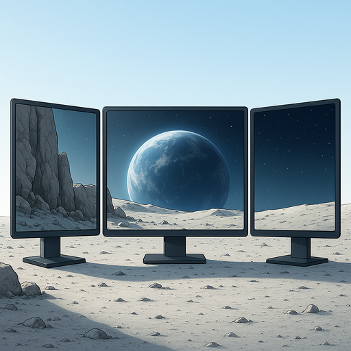

<div align="center">
  

  # SpreadPaper

  ### Spread one high-resolution wallpaper across multiple monitors

  [](LICENSE)
  [](https://www.apple.com/macos/)
  [](https://github.com/rvanbaalen/SpreadPaper/releases/latest)

  **Free • Open Source • Native macOS App**
</div>

---

## What is SpreadPaper?

SpreadPaper is a native macOS utility that lets you use a single high-resolution image as a wallpaper that seamlessly spans across all your connected monitors. No more dealing with separate wallpapers for each display or awkward cropping – just drag, position, and apply.

Perfect for:
- **Multi-monitor setups** with 2, 3, or more displays
- **Ultra-wide panoramic images** that deserve to be displayed in their full glory
- **Creative professionals** who want a cohesive desktop aesthetic
- **Anyone** tired of macOS's limited multi-monitor wallpaper options

## Features

✨ **Visual Positioning** – Drag and position your wallpaper exactly where you want it across all displays

🎯 **Live Preview** – See exactly how your wallpaper will look before applying it

🔄 **Flip & Scale** – Flip horizontally and zoom in/out to get the perfect fit

💾 **Save Presets** – Save your favorite wallpaper configurations for quick switching

🖥️ **Multi-Monitor Smart** – Automatically detects all connected displays and their arrangement

🎨 **High Quality** – Renders at native resolution for each display with optimal quality

## 📥 Download & Installation

**[Download the latest version](https://github.com/rvanbaalen/SpreadPaper/releases/latest)**

Because SpreadPaper is a free, open-source project and not signed with a paid Apple Developer ID ($99/year), macOS Gatekeeper will flag it on the first launch. **This is normal behavior for FOSS apps.**

1. **Download** the `SpreadPaper.dmg` (or `.zip`) from the Releases page.
2. **Open** the DMG and drag **SpreadPaper** to your **Applications** folder.
3. **Right-Click** (or Control-Click) the SpreadPaper app icon in your Applications folder.
4. Select **Open** from the menu.
5. A dialog will appear saying *"SpreadPaper cannot be opened because the developer cannot be verified"* — Click **Open** in this dialog.

*You only need to do this once. Future launches will work normally.*

## How to Use

1. **Launch SpreadPaper** and click "Open" or drag an image onto the window
2. **Position your wallpaper** by dragging it around the preview canvas
3. **Adjust the zoom** using the slider or +/- buttons to get the perfect fit
4. **Flip if needed** to mirror your image horizontally
5. **Click "Apply Wallpaper"** to set it across all your monitors
6. **Save as preset** (optional) to quickly reapply this configuration later

## Requirements

- macOS 15.0 (Sequoia) or later
- Apple Silicon or Intel Mac
- Multiple monitors (recommended, but works with single displays too)

## Building from Source

```bash
# Clone the repository
git clone https://github.com/rvanbaalen/SpreadPaper.git
cd SpreadPaper

# Open in Xcode
open SpreadPaper.xcodeproj

# Build and run (⌘R)
```

## Contributing

Contributions are welcome! Feel free to:
- Report bugs by [opening an issue](https://github.com/rvanbaalen/SpreadPaper/issues)
- Suggest new features
- Submit pull requests

## License

SpreadPaper is free and open source software licensed under the [MIT License](LICENSE).

---

<div align="center">
  Made with ❤️ for the macOS community

  [Download](https://github.com/rvanbaalen/SpreadPaper/releases/latest) • [Report Bug](https://github.com/rvanbaalen/SpreadPaper/issues) • [Request Feature](https://github.com/rvanbaalen/SpreadPaper/issues)
</div>
